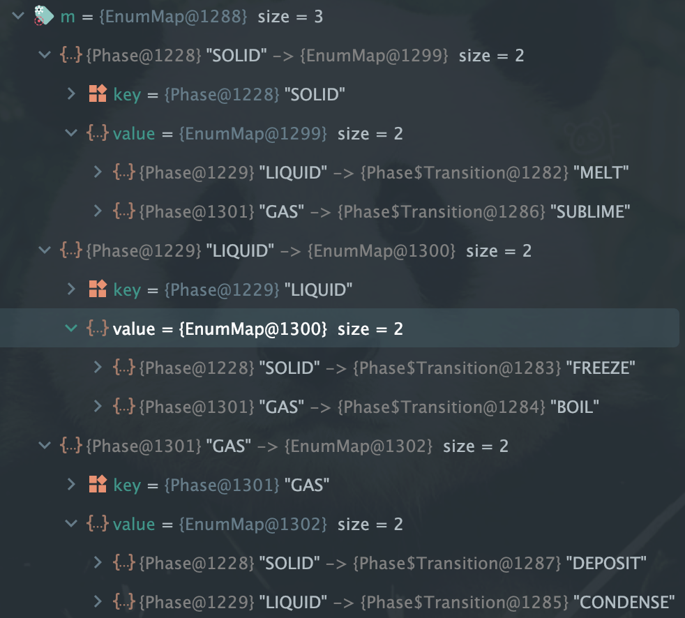
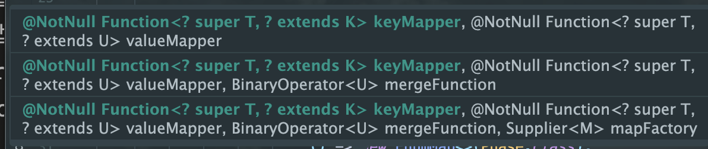

## 아이템 37. ordinal 인덱싱 대신 EnumMap을 사용하라

### ordinal()

- enum의 ordinal은 enum의 순서를 출력한다

```java

  enum LifeCycle { ANNUAL, PERNNIAL, BIENNIAL }

    public static void main(String[] args) {
        System.out.println(LifeCycle.ANNUAL.ordinal()); // 0
        System.out.println(LifeCycle.PERNNIAL.ordinal()); // 1
        System.out.println(LifeCycle.BIENNIAL.ordinal()); // 2
    }

```

### ordinal() 잘못 사용한 사례

```java
class Plant {
 // 식물의 생애 주기를 관리하는 열거 타입
    enum LifeCycle {
        ANNUAL, // 한해살이
        PERENNIAL, // 여러해살이
        BIENNIAL // 두해살이
    }

  final String name;
  final LifeCycle lifeCycle;

  Plant(String name, LifeCycle lifeCycle) {
    this.name = name;
    this.lifeCycle = lifeCycle;
  }

  @Override public String toString() {
    return name;
  }
}
```

- 정원에 심은 식물들을 배열 하나로 관리하고, 이들을 생애주기(한해살이, 여러해살이, 두해살이)별로 묶는다.
- 생애주기 별로 총 3개의 집합을 만들고 정원을 한 바퀴 돌며 각 식물을 해당 집합에 넣는다.

```java
 List<Plant> garden = Arrays.asList(
            new Plant("ANNUAL_1", Plant.LifeCycle.ANNUAL),
            new Plant("ANNUAL_2", Plant.LifeCycle.ANNUAL),
            new Plant("ANNUAL_3", Plant.LifeCycle.ANNUAL),
            new Plant("BIENNIAL_1", Plant.LifeCycle.BIENNIAL),
            new Plant("PERENNIAL_1", Plant.LifeCycle.PERENNIAL)
);

// 생애주기의 종류의 갯수만큼 Set<Plant>[] 생성,
// 즉, 배열 공간 생성
Set<Plant>[] plantsByLifeCycle = 
  (**Set<Plant>[]**) new Set[Plant.LifeCycle.values().length];

// Set<Plant> []의 index마다 비어있는 HashSet<P> 공간 할당
for (int i = 0; i < plantsByLifeCycle.length; i++) 
  plantsByLifeCycle[i] = new HashSet<>();

// Plant의 LifeCycle에 대한 index에 Plant를 add
for(Plant p : garden)
  plantsByLifeCycle[**p.lifeCycle.ordinal()**].add(p);

// 결과 출력
for(int i = 0; i < plantsByLifeCycle.length; i++) {
  System.out.printf("%s: %s%n",
     Plant.LifeCycle.values()[i], plantsByLifeCycle[i]);
}

// 출력 결과
// ANNUAL: [ANNUAL_2, ANNUAL_3, ANNUAL_1]
// PERENNIAL: [PERENNIAL_1]
// BIENNIAL: [BIENNIAL_1]
```

#### 문제점

- 배열은 제네릭과 호환되지 않아 비검사 형변환을 수행해야 한다. ( 아이템 28 )
- 배열의 각 인덱스가 어떤 생애 주기를 의미하는지 알기 위해 `Plant.LifeCycle.values()`를 사용해 레이블을 직접 달아야 한다.
- `plantsByLifeCycle[p.lifeCycle.ordinal()].add(p);` 에서 p.lifeCycle.ordinal()을 사용하여 정수값을 직접 사용한다. 만약 잘못된 값이 사용되면 의도한 값을 보장할 수도 없고 `ArrayIndexOutOfBoundsException`가 발생할 수 있다.
    - ArrayIndexOutOfBoundsException가 발생할 수 있는 예시

```java
Set<Plant>[] plantsByLifeCycle = (Set<Plant>[]) new Set[**2**];
```

- enum의 개수가 3개인데 하드코딩으로 2를 선언하면 배열의 크기를 초과하기 때문에 `ArrayIndexOutOfBoundsException` 발생

#### EnumMap 사용

- EnumMap을 사용하면 위의 문제를 해결할 수 있다.
    - EnumMap은 열거 타입을 키로 사용하도록 설계한 아주 빠른 Map 구현체이다.

- EnumMap을 사용해 데이터와 열거 타입을 매핑한다.

```java
 List<Plant> garden = Arrays.asList(
            new Plant("ANNUAL_1", Plant.LifeCycle.ANNUAL),
            new Plant("ANNUAL_2", Plant.LifeCycle.ANNUAL),
            new Plant("ANNUAL_3", Plant.LifeCycle.ANNUAL),
            new Plant("BIENNIAL_1", Plant.LifeCycle.BIENNIAL),
            new Plant("PERENNIAL_1", Plant.LifeCycle.PERENNIAL)
);

// EnumMap 타입인 plantsByLifeCycle 선언
Map<Plant.LifeCycle, Set<Plant>> plantsByLifeCycle = 
  new EnumMap<>(Plant.LifeCycle.class);

// Enum의 상수(ANNUAL, PERENNIAL, BIENNIAL)별로 순회하면서
// plantsByLifeCycle에 <LifeCycle, Set<Plant>> 자료를 생성
// 즉, 각 상수(ANNUAL, PERENNIAL, BIENNIAL)별로 비어있는 HashSet 할당
for(Plant.LifeCycle lc : Plant.LifeCycle.values()
  plantsByLifeCycle.put(lc, new HashSet<>();

// 정원 내의 화초를 순회
// 화초(i)가 가지고 있는 생애주기로 enumMap의 HashSet을 탐색하고,
// 해당 HashSet에 화초를 추가하고 있다.
// (생애주기 Enum에 대해 하나이상의 화초를 매핑하고 있다.)
for(Plant p : graden)
  plantsByLifeCycle.get(p.lifeCycle).add(p);

System.out.println(plantsByLifeCycle);

// 출력 결과
{ANNUAL=[ANNUAL_2, ANNUAL_3, ANNUAL_1], PERENNIAL=[PERENNIAL_1], BIENNIAL=[BIENNIAL_1]}
```

#### 장점

- 더 짧고 명료하다.
- 성능도 비등하다.
    - 내부에서 배열을 사용하기 때문이다.
- 안전하지 않은 형변환을 쓰지 않는다.
- 맵의 키인 열거 타입이 그 자체로 출력용 문자열을 제공하니 출력 결과에 직접 레이블을 달 일도 없다.
- EnumMap의 생성자가 받는 키 타입의 Class 객체는 한정적 타입 토큰으로, 런타임 제네릭 타입 정보를 제공한다. ( 아이템 33)
    - 타입 정보를 제공하여 EnumMap은 내부적으로 배열을 사용하여 각 열거형 상수에 대한 값을 효율적으로 저장하고 조회할 수 있다.

### 스트림 사용

- 스트림을 사용해 맵을 관리하면 코드를 더 줄일 수 있다.

```java
garden.stream()
   .collect(groupingBy(p -> p.lifeCycle));
```

- EnumMap이 아닌 고유한 맵 구현체를 사용했기 때문에 EnumMap의 공간와 성능 이점을 취할 수 없다.

```java
garden.stream()
                .collect(groupingBy(p -> p.lifeCycle,
                    **() -> new EnumMap<>(LifeCycle.class)**, toSet()));
```

- 매개변수 3개까지 Collectors.groupingBy 메서드의 mapFactory 매개변수에 원하는 맵 구현체를 명시해 호출할 수 있다.

### 스트림과 EnumMap 비교

- EnumMap은 식물의 생애주기당 반드시 하나씩의 중첩 맵을 만든다

```java
EnumMap<Plant.LifeCycle, Set<Plant>> plantByLifeCycle = 
		new EnumMap<>(Plant.LifeCycle.class);

// 모든 생애 주기에 대해 빈 Set을 초기화하기 때문이다.
for (Plant.LifeCycle lc : Plant.LifeCycle.values()) {
    plantByLifeCycle.put(lc, new HashSet<>());
}

```

- 스트림은 식물의 생애주기가 있을 때만 만든다

```java
// 생애 주기별로 그룹화하며, 해당 생애 주기에 속하는 식물이 있을 때만 Set을 생성한다.
Map<Plant.LifeCycle, Set<Plant>> plantByLifeCycle = garden.stream()
                .collect(Collectors.groupingBy(
                        p -> p.lifeCycle,
                        () -> new EnumMap<>(Plant.LifeCycle.class),
                        Collectors.toSet()
                ));
```

### 두 열거 타입의 값들을 매핑하느라 ordinal을 (두 번이나) 쓴 배열들의 배열의 상황

- 두 개의 열거 타입을 억지로 매핑하기 위해 ordinal을 두번이나 쓴 예시

```java
public enum Phase {
    SOLID, // 고체
    LIQUID, // 액제
    GAS; // 기체

    public enum Transition {
        MELT,
        FREEZE, // 응고 (액체 -> 고체)
        BOIL, // 기화 ( 액체 -> 기체)
        CONDENSE,
        SUBLIME,
        DEPOSIT;

        // 행은 from의 ordinal을, 열은 to의 ordinal을 인덱스로 쓴다.
        private static final Transition[][] TRANSITIONS = {
                {null, MELT, SUBLIME}, // null은 고체 -> 고체 라서 null
                {FREEZE, null, BOIL}, // null은 액체 -> 액체 라서 null
                {DEPOSIT, CONDENSE, null} // null은 기체 -> 기체 라서 null
        };

        // 한 상태에서 다른 상태로의 전이를 반환한다
        public static Transition from(Phase from, Phase to) {
            return TRANSITIONS[**from.ordinal()**][**to.ordinal()**];
        }
    }
}
```

#### 문제점

- 컴파일러는 ordinal과 배열 인덱스의 관계를 알 수 없다.
- Phase나 Translation 열거 타입을 수정하면서 TRANSITIONS 표를 수정하지 않으면 런타임 오류가 나거나부정확한 데이터를 반환한다. 또한, 가짓수가 늘어나면 TRANSITIONS 표도 제곱해서 커지며 null로 채워지는 칸도 늘어 난다.

#### EnumMap

- 맵 2개를 중첩하면 된다. 예시를 보자

```java
public enum Phase {
    SOLID, LIQUID, GAS;

    public enum Transition {
        MELT(SOLID, LIQUID), FREEZE(LIQUID, SOLID),
        BOIL(LIQUID, GAS), CONDENSE(GAS, LIQUID),
        SUBLIME(SOLID, GAS), DEPOSIT(GAS, SOLID);

        private final Phase from;
        private final Phase to;

        Transition(Phase from, Phase to) {
            this.from = from;
            this.to = to;
        }

 private static final Map<Phase, Map<Phase, Transition>> m =
    Stream.of(values())
        .collect(
            groupingBy(
                t -> t.from, // 첫 번째 수집기: from 값을 기준으로 그룹화
                () -> new EnumMap<>(Phase.class), // 첫 번째 수집기의 팩토리 함수: EnumMap을 사용하여 그룹화 결과를 저장
                toMap(
                    t -> t.to, // 두 번째 수집기: to 값을 키로 사용
                    t -> t, // 두 번째 수집기: Transition 객체를 값으로 사용
                    (x, y) -> y, // 병합 함수: 실제로 사용되지 않음, 단지 EnumMap 팩토리를 위해 필요
                    () -> new EnumMap<>(Phase.class) // 두 번째 수집기의 팩토리 함수: EnumMap을 사용하여 그룹화된 값을 저장
                )
            )
        );

        public static Transition from(Phase from, Phase to) {
            return m.get(from).get(to);
        }
    }

    public static void main(String[] args) {
        System.out.println(Transition.from(SOLID, LIQUID)); // MELT
        System.out.println(Transition.from(LIQUID, SOLID)); // FREEZE
    }
}
```

- `Map<Phase, Map<Phase, Transition>> m` 는 “이전 상태에서 ‘이후 상태에서 전이로의 맵’에 대응시키는 맵’
    - 바깥 맵 SOLID 예시
    - SOLID(바깥맵) → LIQUID(안쪽맵) → MENT(결과)
    - SOLID(바깥맵) → GAS(안쪽맵) → SUBLIME(결과)  

   

- groupingBy에선 from(이전 상태)을 키값으로 묶었다.
    - private final Phase from;
- toMap에선 그룹화된 전이들의 value에서 to 값을 키로 하고 Transition 값을 값으로 하는 EnumMap으로 매핑하였다
    - 이때 `(x, y) → y`는 선언만하고 실제로는 사용하지 않았다.
        - 키가 충돌할 때 사용하지만 중복된 키가 없기 때문이다.
    - 사용한 이유는 mapFactory 인자에 EnumMap을 얻기 위함이다.  

  

- 하지만… `Map<Phase, Map<Phase, Transition>>`를 만드는 로직이 난해하기 그지 없다. 간단하게 해결할 수 있는 문제면 2차원 배열로 사용하고, 변경 가능성이 높을 때 중첩 EnumMap을 사용하는게 좋겠다.

### 새로운 상태를 추가하는 경우

- 새로운 상태인 플라스마를 추가
    - 기체 → 플라즈마 (이온화)
    - 플라즈마 → 기체 (탈이온화)

#### 배열

```java
public enum Phase {
    SOLID,
    LIQUID,
    GAS,
	  **PLASMA;**

    public enum Transition {
        MELT,
        FREEZE,
        BOIL,
        CONDENSE,
        SUBLIME,
        DEPOSIT,
	      **IONIZE,**
	      **DEIONIZE;**

        private static final Transition[][] TRANSITIONS = {
                {null, MELT, SUBLIME, **null**}, // SOLID
                {FREEZE, null, BOIL, **null**}, // LIQUID
                {DEPOSIT, CONDENSE, null, **OO**}, // GAS
                {**OO, OO, OO, null**}, // PLASMA
        };

        public static Transition from(Phase from, Phase to) {
            return TRANSITIONS[from.ordinal()][to.ordinal()];
        }
    }
}
```

- Phase에 PLASMA 추가
- Transition에 IONIZE, DEIONIZE 추가
- TRANSITIONS 배열은 원소 9개 → 16개로 교체
    - 실수하면 런타임에 문제 발생
    - 책에서는 null을 사용했지만 Transition에 NONE를 추가하여 NONE로 놓는게 NPE 문제 발생여지를 줄일 수 있다.

#### EumMap

- Phase에 PLASMA 추가
- Transactiona에 IONIZE(GAS, PLASMA)와 DEIONIZE(PLASMA, GAS)추가 하면 끝

```java
public enum Phase {
    SOLID, LIQUID, GAS,
    // 신규 PLASMA 추가
    PLASMA;

    public enum Transition {
        MELT(SOLID, LIQUID), FREEZE(LIQUID, SOLID),
        BOIL(LIQUID, GAS), CONDENSE(GAS, LIQUID),
        SUBLIME(SOLID, GAS), DEPOSIT(GAS, SOLID),
        // IONIZE, DEIONIZE 추가
        IONIZE(GAS, PLASMA), DEIONIZE(PLASMA, GAS);

        ... // 나머지 코드는 그대로
    }
}

```

- 기존 로직은 변화가 없기 때문에 잘못 수정할 가능성이 극히 작다.
- `EnumMap<…, EnumMap<…>>` 는 내부적으로 배열들의 배열로 구현되서 공간과 시간이 낭비되는 점이 없다.

### 정리

```
💡 배열의 인덱스를 얻기 위해 ordinal을 사용하는 것은 좋지 않으니 EnumMap을 사용 해라. 다차원의 관계는 EnumMap<…, EnumMap<…>>으로 표현하라.
```
