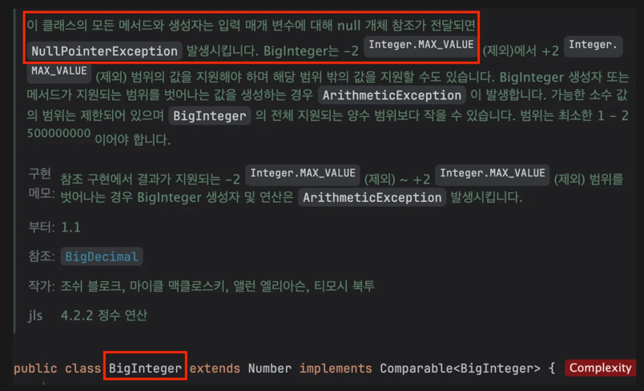

## 매개변수가 유효한지 검사하라

### 오류는 발생한 곳에서 가능한 빨리 잡아야 한다

- 메서드와 생성자의 입력 매개변수에 제약이 있으면 문서화를 해야 하고 메서드 몸체가 시작되기 전에 검사해야 한다.
- 오류를 즉시 잡는다면 잘못된 값이 넘어와도 깔끔하게 예외를 던질 수 있다.

#### 오류를 즉시 잡지 못했을때 문제점

1. 메서드가 수행되는 중간에 모호한 예외를 던지며 실패할 수 있다.
2. 메서드가 잘 수행 되지만 잘못된 결과를 반환할 수 있다.
3. 메서드는 문제없이 수행됐지만, 어떤 객체를 이상한 상태로 만들어 놀 수 있다.
- 위와 같은 문제는 실패 원자성을 어기는 결과를 낳을 수 있다.

```
💡
실패 원자성이란(failure atomicity)
호출된 메서드가 실패하더라도 해당 객체는 메서드 호출 전 상태를 유지하는 것
```

### 예외 문서화

- public과 protected 메서드는 @throws 자바독 태그를 사용하여 매개변수 값이 잘못됐을 때 던지는 예외를 문서화 해야 한다.
- 매개변수 제약을 어겼을 때 발생하는 예외도 함께 기술해야 한다.

```java
/*
* 항상 음이 아닌 BigInteger를 반환하다는 점에서 remainder 메서드와 다르다.
*
* @param m 계수(양수여야 한다.)
* @return 현재 값 mod m
* @throws ArithmeticException m이 0보다 작거나 같으면 발생한다.
*/
public BigInteger mod(BigInteger m) {
    if (m.signum() <= 0)
        throw new ArithmeticException("계수(m)는 양수여야 합니다. " + m);
    ... // 계산 수행
}
```

- BigInteger가 null일 경우에 대한 메서드 설명이 없는데 이는 BigInteger 클래스 수준에서 기술했기 때문이다.
    - 클래스 수준 주석은 해당 클래스의 모든 public 메서드에 적용되므로 각 메서드에 일일이 기술하는 것보다 훨씬 깔끔한 방법이다.


### 자바에 추가된 기능

#### java.util.Objects.requireNonNull

- null 검사를 수동으로 하지 않아도 된다.
- 원하는 예외 메시지도 지정할 수 있다.
- 입력을 그대로 반환하므로 값을 사용하는 동시에 null 검사를 수행할 수 있다.

```java
public class Order {
    private final String orderId;
    private final Customer customer;

    public Order(String orderId, Customer customer) {
        this.orderId = Objects.requireNonNull(orderId, "Order ID cannot be null");
        this.customer = Objects.requireNonNull(customer, "Customer cannot be null");
    }
}
```

- 반환값은 무시하고 순수한 null 검사 목적으로 사용해도 된다

```java
public void processUser(User user) {
    Objects.requireNonNull(user, "User cannot be null");
    // user 객체를 사용한 로직
}
```

#### Objects 범위 검사 기능

- Objects의 checkFromIndexSize, checkFromToIndex, checkIndex는 배열이나 리스트의 인덱스 범위를 검사하는 데 사용된다.
- 유효하지 않은 인덱스가 사용될 경우 IndexOutOfBoundsException을 발생시킨다.
- null 검사 처럼 예외 메시지를 지정할 수 없고, 닫힌 범위(양 끝단 값을 포함하는)는 다루지 못한다.

##### checkFromIndexSize

```java
public List<String> getSubList(List<String> list, int fromIndex, int size) {
    Objects.checkFromIndexSize(fromIndex, size, list.size());
    return list.subList(fromIndex, fromIndex + size);
}

// 사용 예
List<String> names = Arrays.asList("Alice", "Bob", "Charlie", "David");
List<String> subList = getSubList(names, 1, 2); // ["Bob", "Charlie"]
// getSubList(names, 3, 2); // IndexOutOfBoundsException 발생
```

- 인덱스 3에서 시작하여 2개의 요소를 추출하려고 하지만, 리스트의 크기를 초과하여 `IndexOutOfBoundsException` 발생

##### checkFromToIndex

```java
public int[] getSubArray(int[] array, int fromIndex, int toIndex) {
    Objects.checkFromToIndex(fromIndex, toIndex, array.length);
    return Arrays.copyOfRange(array, fromIndex, toIndex);
}

// 사용 예
int[] numbers = {1, 2, 3, 4, 5};
int[] subArray = getSubArray(numbers, 1, 4); // [2, 3, 4]
// getSubArray(numbers, 2, 6); // IndexOutOfBoundsException 발생
```

- 인덱스 2부터 5까지의 요소를 추출하려고 하지만, 배열의 크기(5)를 초과하여 `IndexOutOfBoundsException` 발생

##### checkIndex

```java
public char getCharAtIndex(String str, int index) {
    Objects.checkIndex(index, str.length());
    return str.charAt(index);
}

// 사용 예
String text = "Hello";
char ch = getCharAtIndex(text, 1); // 'e'
// getCharAtIndex(text, 5); // IndexOutOfBoundsException 발생
```

- 유효한 인덱스는 0부터 4까지인데, 인덱스 5는 문자열의 범위를 벗어나므로 `IndexOutOfBoundsException`이 발생

### 단언문(assert문)

- 공개되지 않은 메서드라면 유효한 값이 넘겨지리라는 것을 반드시 보증해야 하는데, 단언문(assert)을 사용해 매개변수 유효성을 검증할 수 있다.

```java
코드 49-2 재귀 정렬용 private 도우미 함수

private static void sort(long a[], int offset, int length) {
    assert a != null;
    assert offset >= 0 && offset <= a.length;
    assert length >= 0 && length <= a.length - offset;
    ... // 계산 수행
}
```

- assert 문들은 해당 조건들이 반드시 참이어야 한다고 선언합니다.
- 만약, assert 문의 조건이 거짓으로 평가되면, `AssertionError`가 발생한다.

#### 일반적인 유효성 검사와 다른점

1. 실패하면 AssertionError를 던진다.
2. 런타임에서 아무런 효과도, 성능 저하도 없다.
- java 명령줄에 -ea 혹은 —enableassertions 플래그를 설정하면 런타임에 영향을 준다
- 보통 개발 중에 테스팅하는 목적으로 사용된다.
- 프로덕션 환경에서는 일반적으로 이 옵션을 사용하지 않아 assertion 검사로 인한 성능 저하를 방지한다.

### 매개변수

```java
코드 20-1 골격 구현을 사용해 완성한 구체 클래스

static List<Integer> intArrayAsList(int[] a) {
    Objects.requireNonNull(a);

    // 다이아몬드 연산자를 이렇게 사용하는 건 자바 9부터 가능하다.
    // 더 낮은 버전을 사용한다면 <Integer>로 수정하자.
    return new AbstractList<>() {
        @Override public Integer get(int i) {
            return a[i];    // 오토박싱(아이템 6)
        }

        @Override public Integer set(int i, Integer val) {
            int oldVal = a[i];
            a[i] = val;     // 오토언박싱
            return oldVal;  // 오토박싱
        }

        @Override public int size() {
            return a.length;
        }
    };
}
```

- `Objects.requireNonNull(a);`가 없다면 List를 받은 클라이언트가 사용하려 할때야 NullPointerException이 발생한다.
    - List를 어디서 가져왔는지 추적하기 어려워 디버깅이 괴로워 진다.
- **생성자 매개변수의 유효성 검사는 클래스 불변식을 어기는 객체가 만들어지지 않게 하는데 꼭 필요하다.**

### 매개변수 유효성 검사 예외 사항

- 유효성 검사 비용이 지나치게 높거나 실용적이지 않을때 혹은 계산 과정에서 암묵적으로 검사가 수행될때는 검사를 꼭 하지 않아도 된다.
- `Collections.sort(List)`는 정렬과정에서 비교가 이루어진다. (암묵적 유효성 검사) 따라서 sort 전에 모든 객체가 상호 비교 될 수 있는지 검사해봐야 실익이 없다.
- 그치만 암묵적 유효성 검사에 너무 의존하다간 실패 원자성을 해칠 수 있으니 주의해야 한다.
- 간혹, 발생한 예외과 문서화된 예외가 다를 수 있는데 이럴 때는 아이템 73의 예외 번역 관용구를 사용하여 API 문서에 기재된 예외로 번역해줘야 한다.

### 핵심정리

```
💡
메서드나 생성자 작성시 매개변수들에 어떤 제약이 있을지 생각해야 한다. 발견한 제약들을 문서화하고 메서드 코드 시작 부분에서 명시적으로 검사하는 습관을 기르자.
```