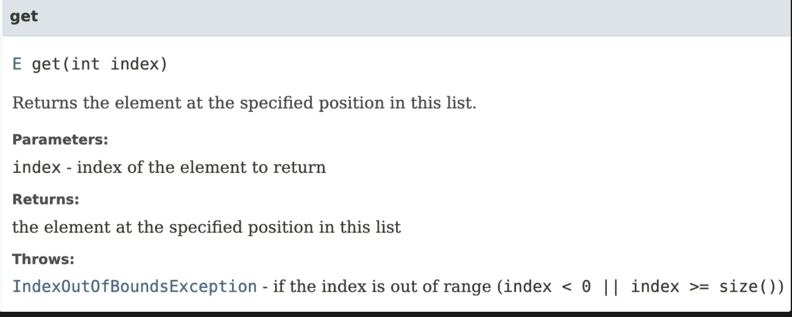

## 공개된 API 요소에는 항상 문서화 주석을 작성하라

### 문서화 주석의 필요성

- 좋은 API는 잘 작성된 문서화도 곁들여야 한다.
- Javadoc은 소스코드 파일에서 문서화 주석이라는 특수한 형태로 기술된 설명을 추출해 API 문서로 변환해준다.
    - https://docs.oracle.com/javase/8/docs/api/index.html
- API를 올바로 문서화하려면 **공개된** 모든 클래스, 인터페이스, 메서드, 필드 선언에 문서화 주석을 달아야 한다.
    - 이유는 클라이언트가 헷갈리지 않도록 사용하기 위함이다.
- 유지보수 까지 생각하면 공개되지 않은 것들 까지 친절하진 않더라도 달면 좋을 것이다.

### 메서드용 문서화 주석

- 메서드용 문서화 주석에는 해당 메서드와 클라이언트 사이의 규약을 명료하게 기술해야 한다.
- 메서드가 어떻게 동작하는지가 아닌 무엇을 하는지 기술해야 한다
    - how가 아닌 what
- 메서드를 호출하기 위한 전제조건(precondition), 메서드가 성공적으로 수행된 후에 만족해야 하는 사후 조건(postcondition)도 모두 나열해야 한다.
- 시스템 상태에 영향을 끼칠 수 있는 부작용도 문서화해야 한다.
- 메서드용 문서화 주석을 완벽히 기술 하려면 다음 태그를 모두 달면 된다.
    - 모든 매개변수에 @param 태그(default 명사구)
    - 반환 타입이 void가 아니라면 @return 태그(default 명사구)
    - 발생할 가능성이 있는 모든 예외에 @throws 태그
- 다음은 위의 규칙들을 모두 반영한 가장 이상적인 문서화 주석

```java
/**
 * Returns the element at the specified position in this list.
 *
 * <p>This method is <i>not</i> guaranteed to run in constant
 * time. In some implementations it may run in time proportional
 * to the element position.
 * @param  index index of element to return; must be
 *         non-negative and less than the size of this list
 * @return the element at the specified position in this list
 * @throws IndexOutOfBoundsException if the index is out of range
 *         ({@code index < 0 || index >= this.size()})
 */
E get(int index);

/**
 * 이 리스트에서 지정한 위치의 원소를 반환한다.
 *
 * <p>이 메서드는 상수 시간에 수행됨을 보장하지 <i>않는다</i>. 구현에 따라
 * 원소의 위치에 비례해 시간이 걸릴 수도 있다.
 *
 * @param  index 반환할 원소의 인덱스; 0 이상이고 리스트 크기보다 작아야 한다.
 * @return 이 리스트에서 지정한 위치의 원소
 * @throws IndexOutOfBoundsException index가 범위를 벗어나면,
 *         즉, ({@code index < 0 || index >= this.size()})이면 발생한다.
 */
E get(int index);
```

- `<p>`와 `<i>`같은 HTML 태그를 사용해도 적용된다.
- {@code} 태그로 감싸면 코드용 폰트로 렌더링 하며, 감싼 내용에 포함된 HTML 요소나 다른 자바독 태그를 무시한다.
- `Returns the element at the specified position in this list.`의 `this list`는 관례상 호출된 메서드가 자리하는 객체를 가리킨다.
- 위 예시의 자바 docs 결과


### @implSpec

- 자바8에 추가된 @implSpec 주석은 해당 메서드와 하위 클래스 사이의 계약을 설명하여, 하위 클래스들이 그 메서드를 상속하거나 super 키워드를 이용해 호출할 때 그 메서드가 어떻게 동작하는지를 명확히 인지하고 사용하도로 해줘야 한다.
- AbstractCollection 인터페이스(아마도..)
```java
/**
* Returns true if this collection is empty.
*
* @implSpec
* This implementation returns {@code this.size() == 0}.
*
* @return true if this collection is empty
*/
public boolean isEmpty() { ... }

/**
* 이 컬렉션이 비었다면 true를 반환한다.
*
* @implSpec
* 이 구현은 {@code this.size() == 0}의 결과를 반환한다.
*
* @return 이 컬렉션이 비었다면 true, 그렇지 않으면 false
*/
public boolean isEmpty() { ... }
```

### @literal

- <, > 등의 HTML 메타문자를 포함시키려면 {@literal} 태그로 감싸는 것이 가장 좋다.

```java
* A geometric series converges if {@literal |r| < 1}.

* {@literal |r| < 1}이면 기하 수열이 수렴한다.

// 아래도 결과는 같지만 읽기가 어렵다.
|r| {@literal <} 10면 기하 수열이 수렴한다.
```

### 요약 설명

#### 클래스

- 문서화 주석의 첫 문장은 요약설명이다.
- 요약 설명이 끝나는 기준은 마침표 인데 `Mrs. 피콕` 같이 중간에 마침표가 나오면 해당 마침표를  {@literal} 태그로 감싸면 된다.

```java
/**
* A suspect, such as Colonel Mustard or {@literal Mrs. Peacock}.
*/
public class Suspect { ... }

우리말로 번역하면 다음과 같다(잘못된 패턴을 남기기 위해 "Mrs. 피콕"은 일부러 번역하지 않았다).

/**
* 머스타드 대령이나 {@literal Mrs. 피콕} 같은 용의자.
*/
public class Suspect { ... }
```

- 자바10부터는 {@summary} 태그를 사용할 수 있다.
```java

/**
 * @summary 사용자의 현재 상태를 나타내는 열거형입니다.
 *
 * @description 이 열거형은 사용자의 상태를 
 * ONLINE, OFFLINE, AWAY, BUSY 등으로 정의합니다.
 */
public enum UserStatus {
    ONLINE,
    OFFLINE,
    AWAY,
    BUSY
}
```

#### 메서드와 생성자

- 메서드와 생성자의 요약 설명은 해당 메서드와 생성자의 동작을 설명하는 (주어가 없는) 동사구여야 한다.

```java
- ArrayList(int initialCapacity): Constructs an empty list with the specified initial capacity.
- Collection.size(): Returns the number of elements in this collection,

- ArrayList(int initialCapacity): 지정한 초기 용량을 갖는 빈 리스트를 생성한다.
- Collection.size(): 이 컬렉션 안의 원소 개수를 반환한다.
```

#### 클래스,인터페이스,필드

- 대상을 설명하는 명사절이여야 한다.

```text
💡
명사절이란?
절이 전체 문장 안에서 명사의 역할을 하는 경우
1.**그 사람이 범인임**이 확실히 밝혀졌다. (주어에 명사절)
2. 나는**사태가 심상치 않음**을 느꼈다. (목적어에 명사절)
3. 병세가 악화되어**환자가 피를 토하기**에 이르렀다. (부사에 명사절)
```

```java
- Instant: An instantaneous point on the time-line.
- Math.PI: The double value that is closer than any other to pi, the ratio of the circumference of a circle to its diameter.

우리말로 번역하면 다음과 같다.

- Instant: 타임라인상의 특정 순간(시점)
- Math.PI: 원주율(pi)에 가장 가까운 double 값
```

### @index

- 자바독 HTML 문서에서 검색을 할 수 있는데 원하는 키워드를 색인하려면 {@index} 태그를 사용하면 된다.

```java
* This method complies with the {@index IEEE 754} standard.

우리말로 번역하면 다음과 같다.

* 이 메서드는 {@index IEEE 754} 표준을 준수한다.
```

### 제네릭

- 제네릭 타입이나 제네릭 메서드를 문서화시 **모든 타입 매개변수**에 주석을 달아야 한다

```java
/**
* An object that maps keys to values. A map cannot contain
* duplicate keys; each key can map to at most one value.
*
* (Remainder omitted)
*
* @param <K> the type of keys maintained by this map
* @param <V> the type of mapped values
*/
public interface Map<K, V> { ... }

/**
* 키와 값을 매핑하는 객체. 맵은 키를 중복해서 가질 수 없다.
* 즉, 키 하나가 가리킬 수 있는 값은 최대 1개다.
*
* (나머지 설명은 생략)
*
* @param <K> 이 맵이 관리하는 키의 타입
* @param <V> 매핑된 값의 타입
*/
public interface Map<K, V> { ... }
```

### 열거타입

- 열거 타입을 문서화할 때는 상수들에도 주석을 달아야 한다

```java
/**
* An instrument section of a symphony orchestra.
*/
public enum OrchestraSection {
   /** Woodwinds, such as flute, clarinet, and oboe. */
   WOODWIND,
   
   /** Brass instruments, such as french horn and trumpet. */
   BRASS,
   
   /** Percussion instruments, such as timpani and cymbals. */
   PERCUSSION,
   
   /** Stringed instruments, such as violin and cello. */
   STRING;
}

/**
* 심포니 오케스트라의 악기 섹션.
*/
public enum OrchestraSection {
   /** 플루트, 클라리넷, 오보 같은 목관악기. */
   WOODWIND,
   
   /** 프렌치 호른, 트럼펫 같은 금관악기. */
   BRASS,
   
   /** 팀파니, 심벌즈 같은 타악기. */
   PERCUSSION,
   
   /** 바이올린, 첼로 같은 현악기. */
   STRING;
}
```

### 애너테이션

- 애너테이션 타입을 문서화할 때는 멤버들에도 모두 주석을 달아야 한다
    - 요약 설명은 동사, 필드 설명은 명사구

```java
/**
* Indicates that the annotated method is a test method that
* must throw the designated exception to pass.
*/
@Retention(RetentionPolicy.RUNTIME)
@Target(ElementType.METHOD)
public @interface ExceptionTest {
   /**
    * The exception that the annotated test method must throw
    * in order to pass. (The test is permitted to throw any
    * subtype of the type described by this class object.)
    */
   Class<? extends Throwable> value();
}

/**
* 이 애너테이션이 달린 메서드는 명시한 예외를 던져야만 성공하는
* 테스트 메서드임을 나타낸다.
*/
@Retention(RetentionPolicy.RUNTIME)
@Target(ElementType.METHOD) 
public @interface ExceptionTest {
   /**
    * 이 애너테이션을 단 테스트 메서드가 성공하려면 던져야 하는 예외.
    * (이 클래스의 하위 타입 예외는 모두 허용된다.)
    */
   Class<? extends Throwable> value();
}
```

### 패키지, 모듈

- 패키지를 설명하는 문서화 주석은 [package-info.java](http://package-info.java) 파일에 작성
- 모듈 관련 설명은 [module-info.java](http://module-info.java) 파일에 작성

### 스레드, 직렬화

- 클래스 혹은 정적 메서드가 스레드 안전하든 그렇지 않든, 스레드 안전 수준을 반드시 API 설명에 포함해야 한다
- 직렬화할 수 있는 클래스라면 직렬화 형태도 API 설명에 기술해야 한다

### 메서드 주석 상속

- 자바독은 메서드 주석을 ‘상속’시킬 수 있다.
- 문서화 주석이 없으면 상위 요소의 인터페이스 > 클래스 순으로 가장 가까운 문서화 주석을 찾는다.

### @inheritDoc

- {@inheritDoc} 태그를 사용하면 상위 타입의 문서화 주석 일부를 상속할 수 있다.

### 주의 사항

- 여러 클래스가 상호작용하는 복잡한 APi라면 전체 아키텍처를 설명하는 설명 문서의 링크도 제공해주면 좋다.
- 자바독 문서를 올바르게 작성했는지 확인하는 여러가지 방법이 있다.
    - 자바7의 -Xdoclint 옵션
    - IDC 플러그인
    - 다양한 HTML 유효성 검사기
- 생성한 API 문서를 반드시 검토해라

### 핵심 정리

```text
💡공개 API라면 빠짐없이 API를 문서화 해야 한다. 표준 규약을 일관되게 지키자. 
필요시 HTML 태그를 사용할 수 있다.
```